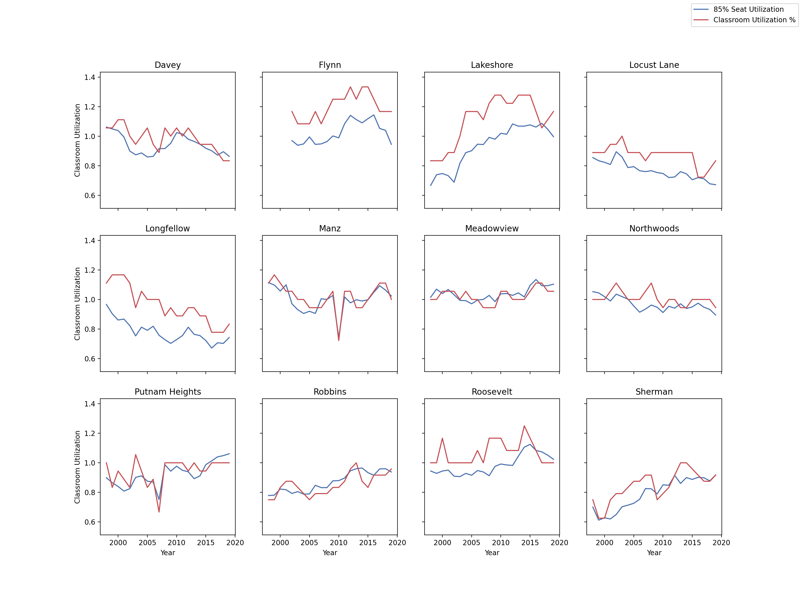
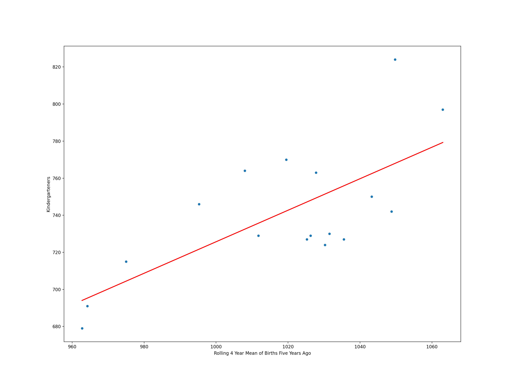
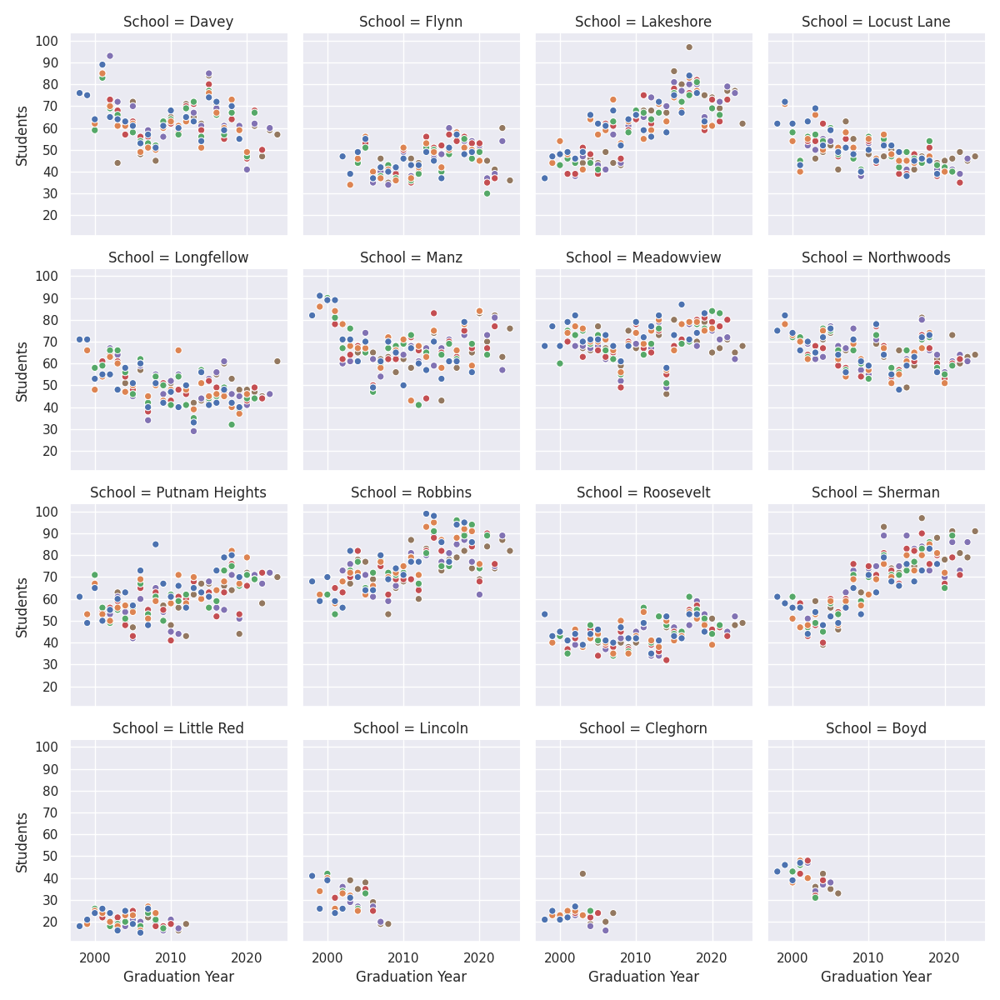
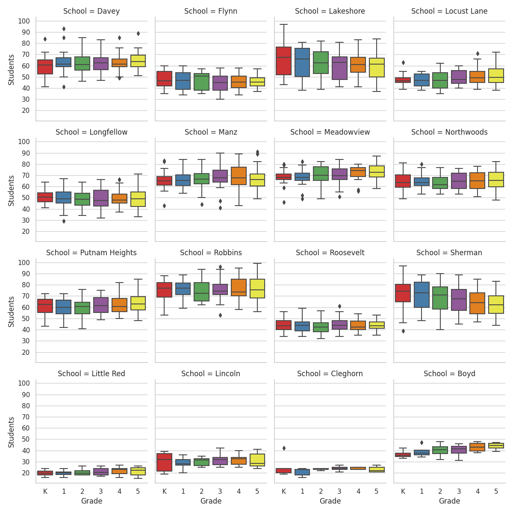

# ECASD Elementary Enrollment Data Analysis
Analysis of ECASD elementary enrollment data by Justin Hendrickson.

## Data
The data used to generate the reports is in the ./data directory.

### __init__.py
Python file that sets up the birth and enrollment dataframes for ECASD.

This data was obtained from Eau Claire Area School District and Wisconsin Department of Health Services via open
records requests.

### enrollment_info.py
Python file that contains methods for extracting useful dataframes from the enrollment data.

### kindergarten.py
Python file that contains methods for extracting useful kindergaten-related dataframes from the birth and enrollment 
data.

### Third Friday.ods
Spreadsheet containing the yearly ECASD elementary school enrollment data.

## Analysis
Analysis of the data is contained in the following files.

### capacity-vs-classrooms.py
Creates a graph that shows the 85% school capacity value vs the classroom utilization ratio.

#### Note
The classroom utilization ratio is based on the number of classrooms in use / (the stated number of sections at the school * 6).

### Enrollment Data Analysis.ipynb
Jupyter Notebook exploration of capacity and classroom usage across the district.

### linear-regression-of-births-to-kindergarten-enrollment.py
Creates a graph and prints a [linear regression](https://en.wikipedia.org/wiki/Linear_regression) summary of the number of the district kindergarten enrollments and a four year rolling average of the births in the ECASD boundaries from five years ago.

 

### linear-regression-of-previous-years-enrollment-to-kindergarten-enrollment.py
Prints a [linear regression](https://en.wikipedia.org/wiki/Linear_regression) summary of the district enrollment and district enrollment the previous year.

### Linear Regression of School Population to Classroom Count
Jupyter Notebook [analysis of the relationship between the number of students at a school and the number of classrooms in use at the school](Linear Regression of Yearly School Population and Classroom Usage.ipynb).

### per-school-cohort-size-distribution.py
Creates a graph showing the distribution of cohort sizes by school, per year.

### per-school-grade-size-distribution.py
Creates a graph showing the distribution of students at each school by grade for all the years in the enrollment data.

### predicted-number-of-kindergarteners-graph.py
Creates a graph showing the predicted and actual number of kindergarteners in the district, per year.

The prediction is based on the three year rolling average of the number of births five years ago vs enrollments.

### predicted-per-school-kindergarteners.py
Creates a graph showing the predicted and actual number of kindergarteners by school, per year.

The prediction is based on the three year rolling average of the number of births five years ago vs enrollments and the
three year rolling average percent share of kindergarteners in the district that attend each school.

### predicted-share-by-grade-graph.py
Creates a graph showing the predicted and actual share of students attending a school by grade, per year.

The prediction is based on the three year rolling average percent share of students in the district attending a school
by grade.
