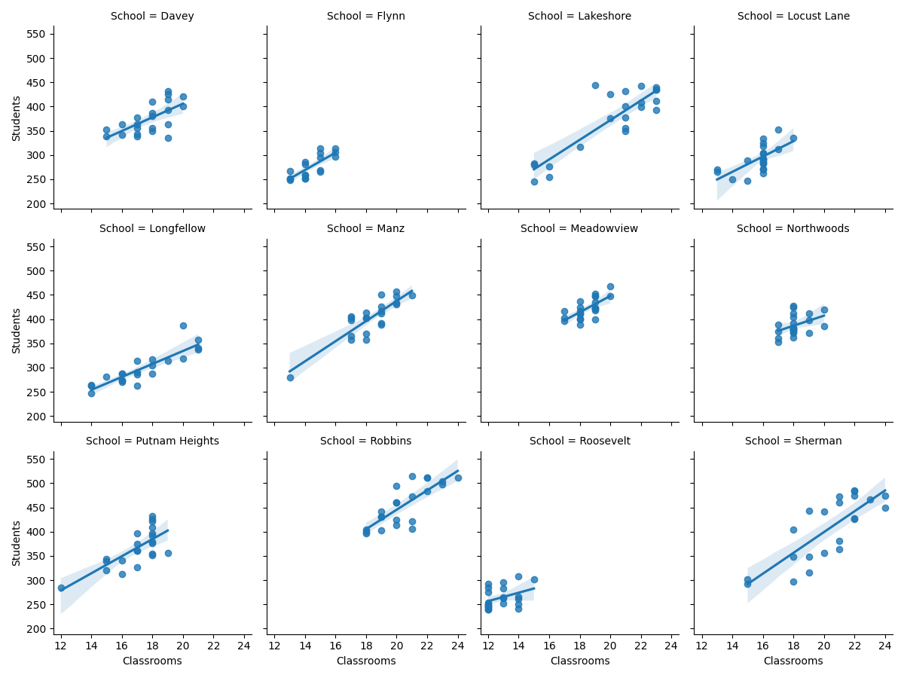

# Linear Regression of Yearly School Population to Classroom Usage
Is there a correlation between the number of students at a school and the number of classrooms in use that year? If so,
can we quantify it's accuracy?

By generating a dataframe of student population and classrooms in use for each school and year, I have generated an
[ordinary least squares](https://en.wikipedia.org/wiki/Ordinary_least_squares)
[linear regression](https://en.wikipedia.org/wiki/Linear_regression) model.



## OLS Regression Summaries

### Davey
```text
                            OLS Regression Results                            
==============================================================================
Dep. Variable:             Classrooms   R-squared:                       0.424
Model:                            OLS   Adj. R-squared:                  0.395
Method:                 Least Squares   F-statistic:                     14.72
Date:                Sat, 22 Aug 2020   Prob (F-statistic):            0.00103
Time:                        15:03:08   Log-Likelihood:                -32.741
No. Observations:                  22   AIC:                             69.48
Df Residuals:                      20   BIC:                             71.66
Df Model:                           1                                         
Covariance Type:            nonrobust                                         
==============================================================================
                 coef    std err          t      P>|t|      [0.025      0.975]
------------------------------------------------------------------------------
Intercept      6.4962      2.949      2.203      0.040       0.344      12.648
Students       0.0301      0.008      3.836      0.001       0.014       0.046
==============================================================================
Omnibus:                        0.156   Durbin-Watson:                   1.208
Prob(Omnibus):                  0.925   Jarque-Bera (JB):                0.143
Skew:                           0.143   Prob(JB):                        0.931
Kurtosis:                       2.726   Cond. No.                     4.62e+03
==============================================================================

Warnings:
[1] Standard Errors assume that the covariance matrix of the errors is correctly specified.
[2] The condition number is large, 4.62e+03. This might indicate that there are
strong multicollinearity or other numerical problems.
```


### Flynn
```text
                            OLS Regression Results                            
==============================================================================
Dep. Variable:             Classrooms   R-squared:                       0.621
Model:                            OLS   Adj. R-squared:                  0.598
Method:                 Least Squares   F-statistic:                     26.26
Date:                Sat, 22 Aug 2020   Prob (F-statistic):           0.000102
Time:                        15:03:08   Log-Likelihood:                -16.937
No. Observations:                  18   AIC:                             37.87
Df Residuals:                      16   BIC:                             39.66
Df Model:                           1                                         
Covariance Type:            nonrobust                                         
==============================================================================
                 coef    std err          t      P>|t|      [0.025      0.975]
------------------------------------------------------------------------------
Intercept      4.8158      1.875      2.569      0.021       0.842       8.790
Students       0.0347      0.007      5.125      0.000       0.020       0.049
==============================================================================
Omnibus:                        3.469   Durbin-Watson:                   1.635
Prob(Omnibus):                  0.177   Jarque-Bera (JB):                1.269
Skew:                           0.025   Prob(JB):                        0.530
Kurtosis:                       1.700   Cond. No.                     3.35e+03
==============================================================================

Warnings:
[1] Standard Errors assume that the covariance matrix of the errors is correctly specified.
[2] The condition number is large, 3.35e+03. This might indicate that there are
strong multicollinearity or other numerical problems.
```


### Lakeshore
```text
                            OLS Regression Results                            
==============================================================================
Dep. Variable:             Classrooms   R-squared:                       0.764
Model:                            OLS   Adj. R-squared:                  0.752
Method:                 Least Squares   F-statistic:                     64.58
Date:                Sat, 22 Aug 2020   Prob (F-statistic):           1.09e-07
Time:                        15:03:08   Log-Likelihood:                -38.103
No. Observations:                  22   AIC:                             80.21
Df Residuals:                      20   BIC:                             82.39
Df Model:                           1                                         
Covariance Type:            nonrobust                                         
==============================================================================
                 coef    std err          t      P>|t|      [0.025      0.975]
------------------------------------------------------------------------------
Intercept      5.9799      1.771      3.376      0.003       2.285       9.674
Students       0.0377      0.005      8.036      0.000       0.028       0.047
==============================================================================
Omnibus:                        4.233   Durbin-Watson:                   0.763
Prob(Omnibus):                  0.120   Jarque-Bera (JB):                2.470
Skew:                          -0.777   Prob(JB):                        0.291
Kurtosis:                       3.527   Cond. No.                     2.19e+03
==============================================================================

Warnings:
[1] Standard Errors assume that the covariance matrix of the errors is correctly specified.
[2] The condition number is large, 2.19e+03. This might indicate that there are
strong multicollinearity or other numerical problems.
```


### Locust Lane
```text
                            OLS Regression Results                            
==============================================================================
Dep. Variable:             Classrooms   R-squared:                       0.423
Model:                            OLS   Adj. R-squared:                  0.394
Method:                 Least Squares   F-statistic:                     14.67
Date:                Sat, 22 Aug 2020   Prob (F-statistic):            0.00105
Time:                        15:03:08   Log-Likelihood:                -27.961
No. Observations:                  22   AIC:                             59.92
Df Residuals:                      20   BIC:                             62.10
Df Model:                           1                                         
Covariance Type:            nonrobust                                         
==============================================================================
                 coef    std err          t      P>|t|      [0.025      0.975]
------------------------------------------------------------------------------
Intercept      7.8959      2.054      3.844      0.001       3.611      12.180
Students       0.0268      0.007      3.830      0.001       0.012       0.041
==============================================================================
Omnibus:                        5.827   Durbin-Watson:                   1.336
Prob(Omnibus):                  0.054   Jarque-Bera (JB):                3.961
Skew:                          -1.012   Prob(JB):                        0.138
Kurtosis:                       3.473   Cond. No.                     3.13e+03
==============================================================================

Warnings:
[1] Standard Errors assume that the covariance matrix of the errors is correctly specified.
[2] The condition number is large, 3.13e+03. This might indicate that there are
strong multicollinearity or other numerical problems.
```


### Longfellow
```text
                            OLS Regression Results                            
==============================================================================
Dep. Variable:             Classrooms   R-squared:                       0.762
Model:                            OLS   Adj. R-squared:                  0.750
Method:                 Least Squares   F-statistic:                     64.05
Date:                Sat, 22 Aug 2020   Prob (F-statistic):           1.16e-07
Time:                        15:03:08   Log-Likelihood:                -32.800
No. Observations:                  22   AIC:                             69.60
Df Residuals:                      20   BIC:                             71.78
Df Model:                           1                                         
Covariance Type:            nonrobust                                         
==============================================================================
                 coef    std err          t      P>|t|      [0.025      0.975]
------------------------------------------------------------------------------
Intercept      0.3294      2.136      0.154      0.879      -4.127       4.786
Students       0.0569      0.007      8.003      0.000       0.042       0.072
==============================================================================
Omnibus:                        0.443   Durbin-Watson:                   1.025
Prob(Omnibus):                  0.801   Jarque-Bera (JB):                0.572
Skew:                          -0.209   Prob(JB):                        0.751
Kurtosis:                       2.331   Cond. No.                     2.67e+03
==============================================================================

Warnings:
[1] Standard Errors assume that the covariance matrix of the errors is correctly specified.
[2] The condition number is large, 2.67e+03. This might indicate that there are
strong multicollinearity or other numerical problems.
```


### Manz
```text
                            OLS Regression Results                            
==============================================================================
Dep. Variable:             Classrooms   R-squared:                       0.750
Model:                            OLS   Adj. R-squared:                  0.737
Method:                 Least Squares   F-statistic:                     59.96
Date:                Sat, 22 Aug 2020   Prob (F-statistic):           1.92e-07
Time:                        15:03:08   Log-Likelihood:                -26.781
No. Observations:                  22   AIC:                             57.56
Df Residuals:                      20   BIC:                             59.74
Df Model:                           1                                         
Covariance Type:            nonrobust                                         
==============================================================================
                 coef    std err          t      P>|t|      [0.025      0.975]
------------------------------------------------------------------------------
Intercept      3.7717      1.887      1.998      0.059      -0.165       7.709
Students       0.0361      0.005      7.744      0.000       0.026       0.046
==============================================================================
Omnibus:                        2.514   Durbin-Watson:                   1.868
Prob(Omnibus):                  0.285   Jarque-Bera (JB):                1.215
Skew:                          -0.138   Prob(JB):                        0.545
Kurtosis:                       1.883   Cond. No.                     4.18e+03
==============================================================================

Warnings:
[1] Standard Errors assume that the covariance matrix of the errors is correctly specified.
[2] The condition number is large, 4.18e+03. This might indicate that there are
strong multicollinearity or other numerical problems.
```


### Meadowview
```text
                            OLS Regression Results                            
==============================================================================
Dep. Variable:             Classrooms   R-squared:                       0.474
Model:                            OLS   Adj. R-squared:                  0.447
Method:                 Least Squares   F-statistic:                     17.99
Date:                Sat, 22 Aug 2020   Prob (F-statistic):           0.000400
Time:                        15:03:08   Log-Likelihood:                -20.275
No. Observations:                  22   AIC:                             44.55
Df Residuals:                      20   BIC:                             46.73
Df Model:                           1                                         
Covariance Type:            nonrobust                                         
==============================================================================
                 coef    std err          t      P>|t|      [0.025      0.975]
------------------------------------------------------------------------------
Intercept      6.5272      2.815      2.318      0.031       0.654      12.400
Students       0.0283      0.007      4.241      0.000       0.014       0.042
==============================================================================
Omnibus:                        0.250   Durbin-Watson:                   1.286
Prob(Omnibus):                  0.882   Jarque-Bera (JB):                0.407
Skew:                          -0.195   Prob(JB):                        0.816
Kurtosis:                       2.460   Cond. No.                     8.74e+03
==============================================================================

Warnings:
[1] Standard Errors assume that the covariance matrix of the errors is correctly specified.
[2] The condition number is large, 8.74e+03. This might indicate that there are
strong multicollinearity or other numerical problems.
```


### Northwoods
```text
                            OLS Regression Results                            
==============================================================================
Dep. Variable:             Classrooms   R-squared:                       0.169
Model:                            OLS   Adj. R-squared:                  0.128
Method:                 Least Squares   F-statistic:                     4.074
Date:                Sat, 22 Aug 2020   Prob (F-statistic):             0.0572
Time:                        15:03:08   Log-Likelihood:                -24.660
No. Observations:                  22   AIC:                             53.32
Df Residuals:                      20   BIC:                             55.50
Df Model:                           1                                         
Covariance Type:            nonrobust                                         
==============================================================================
                 coef    std err          t      P>|t|      [0.025      0.975]
------------------------------------------------------------------------------
Intercept     11.8363      3.126      3.787      0.001       5.317      18.356
Students       0.0163      0.008      2.018      0.057      -0.001       0.033
==============================================================================
Omnibus:                        3.925   Durbin-Watson:                   1.038
Prob(Omnibus):                  0.140   Jarque-Bera (JB):                2.452
Skew:                           0.805   Prob(JB):                        0.293
Kurtosis:                       3.282   Cond. No.                     7.31e+03
==============================================================================

Warnings:
[1] Standard Errors assume that the covariance matrix of the errors is correctly specified.
[2] The condition number is large, 7.31e+03. This might indicate that there are
strong multicollinearity or other numerical problems.
```


### Putnam Heights
```text
                            OLS Regression Results                            
==============================================================================
Dep. Variable:             Classrooms   R-squared:                       0.527
Model:                            OLS   Adj. R-squared:                  0.503
Method:                 Least Squares   F-statistic:                     22.26
Date:                Sat, 22 Aug 2020   Prob (F-statistic):           0.000132
Time:                        15:03:08   Log-Likelihood:                -32.650
No. Observations:                  22   AIC:                             69.30
Df Residuals:                      20   BIC:                             71.48
Df Model:                           1                                         
Covariance Type:            nonrobust                                         
==============================================================================
                 coef    std err          t      P>|t|      [0.025      0.975]
------------------------------------------------------------------------------
Intercept      6.0200      2.330      2.584      0.018       1.160      10.880
Students       0.0299      0.006      4.718      0.000       0.017       0.043
==============================================================================
Omnibus:                        0.525   Durbin-Watson:                   2.013
Prob(Omnibus):                  0.769   Jarque-Bera (JB):                0.014
Skew:                          -0.017   Prob(JB):                        0.993
Kurtosis:                       3.118   Cond. No.                     3.59e+03
==============================================================================

Warnings:
[1] Standard Errors assume that the covariance matrix of the errors is correctly specified.
[2] The condition number is large, 3.59e+03. This might indicate that there are
strong multicollinearity or other numerical problems.
```


### Robbins
```text
                            OLS Regression Results                            
==============================================================================
Dep. Variable:             Classrooms   R-squared:                       0.625
Model:                            OLS   Adj. R-squared:                  0.607
Method:                 Least Squares   F-statistic:                     33.38
Date:                Sat, 22 Aug 2020   Prob (F-statistic):           1.18e-05
Time:                        15:03:08   Log-Likelihood:                -31.718
No. Observations:                  22   AIC:                             67.44
Df Residuals:                      20   BIC:                             69.62
Df Model:                           1                                         
Covariance Type:            nonrobust                                         
==============================================================================
                 coef    std err          t      P>|t|      [0.025      0.975]
------------------------------------------------------------------------------
Intercept      6.2634      2.467      2.539      0.020       1.117      11.409
Students       0.0312      0.005      5.777      0.000       0.020       0.043
==============================================================================
Omnibus:                        1.624   Durbin-Watson:                   1.131
Prob(Omnibus):                  0.444   Jarque-Bera (JB):                1.313
Skew:                           0.424   Prob(JB):                        0.519
Kurtosis:                       2.156   Cond. No.                     4.92e+03
==============================================================================

Warnings:
[1] Standard Errors assume that the covariance matrix of the errors is correctly specified.
[2] The condition number is large, 4.92e+03. This might indicate that there are
strong multicollinearity or other numerical problems.
```


### Roosevelt
```text
                            OLS Regression Results                            
==============================================================================
Dep. Variable:             Classrooms   R-squared:                       0.149
Model:                            OLS   Adj. R-squared:                  0.106
Method:                 Least Squares   F-statistic:                     3.498
Date:                Sat, 22 Aug 2020   Prob (F-statistic):             0.0762
Time:                        15:03:08   Log-Likelihood:                -27.988
No. Observations:                  22   AIC:                             59.98
Df Residuals:                      20   BIC:                             62.16
Df Model:                           1                                         
Covariance Type:            nonrobust                                         
==============================================================================
                 coef    std err          t      P>|t|      [0.025      0.975]
------------------------------------------------------------------------------
Intercept      8.2978      2.425      3.422      0.003       3.240      13.356
Students       0.0171      0.009      1.870      0.076      -0.002       0.036
==============================================================================
Omnibus:                        2.270   Durbin-Watson:                   1.266
Prob(Omnibus):                  0.321   Jarque-Bera (JB):                1.759
Skew:                           0.539   Prob(JB):                        0.415
Kurtosis:                       2.131   Cond. No.                     3.32e+03
==============================================================================

Warnings:
[1] Standard Errors assume that the covariance matrix of the errors is correctly specified.
[2] The condition number is large, 3.32e+03. This might indicate that there are
strong multicollinearity or other numerical problems.
```


### Sherman
```text
                            OLS Regression Results                            
==============================================================================
Dep. Variable:             Classrooms   R-squared:                       0.634
Model:                            OLS   Adj. R-squared:                  0.616
Method:                 Least Squares   F-statistic:                     34.70
Date:                Sat, 22 Aug 2020   Prob (F-statistic):           9.21e-06
Time:                        15:03:08   Log-Likelihood:                -39.551
No. Observations:                  22   AIC:                             83.10
Df Residuals:                      20   BIC:                             85.28
Df Model:                           1                                         
Covariance Type:            nonrobust                                         
==============================================================================
                 coef    std err          t      P>|t|      [0.025      0.975]
------------------------------------------------------------------------------
Intercept      8.2952      2.059      4.028      0.001       3.999      12.591
Students       0.0296      0.005      5.891      0.000       0.019       0.040
==============================================================================
Omnibus:                        4.224   Durbin-Watson:                   0.860
Prob(Omnibus):                  0.121   Jarque-Bera (JB):                1.548
Skew:                          -0.165   Prob(JB):                        0.461
Kurtosis:                       1.743   Cond. No.                     2.59e+03
==============================================================================

Warnings:
[1] Standard Errors assume that the covariance matrix of the errors is correctly specified.
[2] The condition number is large, 2.59e+03. This might indicate that there are
strong multicollinearity or other numerical problems.
```


''Generated at {generated_at}''